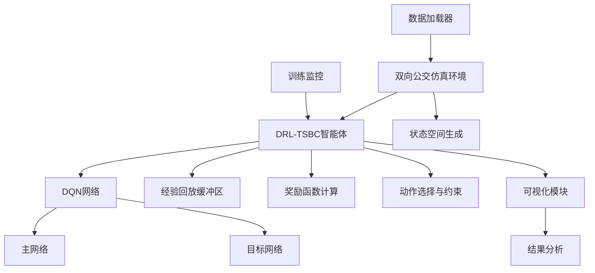

# 设计文档

## 概述

本设计文档详细描述了DRL-TSBC算法复现的技术架构和实现方案。基于谢嘉昊论文中的技术规范，我们将构建一个完整的深度强化学习系统，用于双向动态公交时刻表排班。

## 架构

### 系统架构图



### 核心组件关系

1. **数据流**: 乘客数据 → 仿真环境 → 状态表示 → DQN决策 → 动作执行 → 奖励计算
2. **学习流**: 经验收集 → 回放缓冲区 → 批量采样 → 网络训练 → 参数更新
3. **评估流**: 训练模型 → 测试环境 → 性能指标 → 可视化结果

## 组件和接口

### 1. 数据处理组件

#### PassengerDataLoader
```python
class PassengerDataLoader:
    def __init__(self, data_path: str, routes: List[str])
    def load_passenger_data(self) -> Dict[str, pd.DataFrame]
    def preprocess_data(self) -> Dict[str, np.ndarray]
    def estimate_arrival_times(self, boarding_times: np.ndarray) -> np.ndarray
    def generate_flow_matrix(self, route: str) -> np.ndarray
```

**接口规范**:
- 输入: CSV格式的乘客刷卡数据
- 输出: 标准化的客流矩阵
- 数据格式: 乘客ID、上车时间、上车站点、下车站点、到达时间

### 2. 仿真环境组件

#### BidirectionalBusEnvironment
```python
class BidirectionalBusEnvironment:
    def __init__(self, 
                 service_start: int = 360,  # 6:00
                 service_end: int = 1320,   # 22:00
                 num_stations_up: int = 26,
                 num_stations_down: int = 24,
                 vehicle_capacity: int = 48,  # 32座位 * 1.5
                 tmin: int = 3,
                 tmax: int = 15)
    
    def reset(self) -> np.ndarray
    def step(self, action: Tuple[int, int]) -> Tuple[np.ndarray, float, bool, Dict]
    def get_state(self) -> np.ndarray
    def calculate_reward(self, action: Tuple[int, int]) -> float
    def apply_constraints(self, action: Tuple[int, int]) -> Tuple[int, int]
```

**状态空间设计** (10维):
```python
state = [
    a1_m,  # 标准化小时 (th/24)
    a2_m,  # 标准化分钟 (tm/60)
    x1_m,  # 上行满载率
    x2_m,  # 上行等待时间
    x3_m,  # 上行运力利用率
    x4_m,  # 上行发车次数
    y1_m,  # 下行满载率
    y2_m,  # 下行等待时间
    y3_m,  # 下行运力利用率
    y4_m   # 下行发车次数
]
```

**动作空间设计**:
```python
actions = {
    0: (0, 0),  # 上下行都不发车
    1: (0, 1),  # 上行不发车，下行发车
    2: (1, 0),  # 上行发车，下行不发车
    3: (1, 1)   # 上下行都发车
}
```

### 3. DRL-TSBC智能体组件

#### DRLTSBCAgent
```python
class DRLTSBCAgent:
    def __init__(self,
                 state_dim: int = 10,
                 action_dim: int = 4,
                 learning_rate: float = 0.001,
                 gamma: float = 0.4,
                 epsilon: float = 0.1,
                 buffer_size: int = 3000,
                 batch_size: int = 64)
    
    def select_action(self, state: np.ndarray) -> int
    def store_experience(self, state, action, reward, next_state, done)
    def train(self) -> float
    def update_target_network(self)
    def save_model(self, path: str)
    def load_model(self, path: str)
```

#### DQN网络架构
```python
class DQNNetwork(nn.Module):
    def __init__(self, state_dim: int = 10, action_dim: int = 4):
        super().__init__()
        # 按照论文表2-2规范
        self.layers = nn.ModuleList([
            nn.Linear(state_dim, 500),
            *[nn.Linear(500, 500) for _ in range(11)],  # 12层隐藏层
            nn.Linear(500, action_dim)
        ])
        self.activation = nn.ReLU()
        
    def forward(self, x: torch.Tensor) -> torch.Tensor
```

**网络参数** (严格按照论文表2-2):
- 学习率: 0.001
- 权重初始化: 正态分布
- 激活函数: ReLU
- 隐层数量: 12
- 隐层神经元数量: 500
- 批次大小: 64
- 折现系数: 0.4
- 经验池大小: 3000
- ε: 0.1
- 学习频率: 5
- 参数更新频率: 100

### 4. 奖励函数组件

#### RewardCalculator
```python
class RewardCalculator:
    def __init__(self, mu: float = 5000, delta: float = 200, 
                 beta: float = 0.2, zeta: float = 0.002):
        
    def calculate_bidirectional_reward(self, 
                                     action: Tuple[int, int],
                                     state: Dict) -> float:
        """
        实现论文方程(2.15)-(2.17)
        """
        r_up = self._calculate_direction_reward('up', action[0], state)
        r_down = self._calculate_direction_reward('down', action[1], state)
        return r_up + r_down
    
    def _calculate_direction_reward(self, direction: str, 
                                  action: int, state: Dict) -> float:
        """
        实现论文方程(2.16)和(2.17)
        """
```

**奖励函数实现**:
- 上行奖励: 方程(2.16)
- 下行奖励: 方程(2.17)
- 双向约束: ζ × (c_up - c_down)
- 运力利用率: o_m/e_m
- 等待时间惩罚: ω × W_m
- 滞留乘客惩罚: β × d_m

## 数据模型

### 乘客数据模型
```python
@dataclass
class PassengerRecord:
    label: str          # 乘客唯一标识码
    boarding_time: int  # 上车时间(分钟)
    boarding_station: int  # 上车站点
    alighting_station: int # 下车站点
    arrival_time: int   # 到达时间(分钟)
```

### 系统状态模型
```python
@dataclass
class SystemState:
    current_time: int
    upward_buses: List[Bus]
    downward_buses: List[Bus]
    waiting_passengers_up: Dict[int, List[Passenger]]
    waiting_passengers_down: Dict[int, List[Passenger]]
    departure_count_up: int
    departure_count_down: int
    last_departure_time_up: int
    last_departure_time_down: int
```

### 训练记录模型
```python
@dataclass
class TrainingMetrics:
    episode: int
    total_reward: float
    average_waiting_time: float
    departure_count_up: int
    departure_count_down: int
    epsilon: float
    loss: float
    stranded_passengers: int
```

## 错误处理

### 1. 数据验证错误
- **数据格式错误**: 验证CSV文件格式和必需字段
- **时间范围错误**: 确保时间数据在合理范围内
- **站点编号错误**: 验证站点编号的有效性

### 2. 训练过程错误
- **内存不足**: 监控GPU内存使用，必要时减少批次大小
- **收敛失败**: 实现早停机制和学习率调度
- **梯度爆炸**: 使用梯度裁剪

### 3. 约束违反错误
- **发车间隔违反**: 强制应用Tmin和Tmax约束
- **双向不平衡**: 实现推理阶段的平衡调整算法

## 测试策略

### 1. 单元测试
- **数据加载器测试**: 验证数据预处理的正确性
- **状态空间测试**: 确保状态维度和归一化正确
- **奖励函数测试**: 验证奖励计算与论文公式一致
- **网络结构测试**: 确认DQN架构符合规范

### 2. 集成测试
- **环境-智能体交互**: 测试完整的训练循环
- **约束应用测试**: 验证发车间隔约束的正确应用
- **双向平衡测试**: 确保最终发车次数相等

### 3. 性能测试
- **训练收敛测试**: 验证模型能够收敛到稳定策略
- **实时决策测试**: 确保每分钟决策的时间复杂度可接受
- **内存使用测试**: 监控长时间训练的内存稳定性

### 4. 对比测试
- **与人工方案对比**: 复现论文表2-3的结果
- **与DRL-TO对比**: 验证双向调度的优势
- **消融研究**: 验证各组件的重要性

## 实现计划

### 阶段1: 基础设施验证
1. 检查现有代码与论文规范的一致性
2. 验证GPU环境配置(CUDA 11.8 + RTX 4060)
3. 确认数据格式和加载流程

### 阶段2: 核心算法实现
1. 完善DQN网络结构(12层×500神经元)
2. 实现精确的奖励函数(方程2.16-2.17)
3. 优化状态空间表示(10维特征)

### 阶段3: 训练和优化
1. 实现完整的训练循环
2. 添加训练监控和可视化
3. 参数调优和收敛验证

### 阶段4: 实验和评估
1. 离线调度实验
2. 在线适应性测试
3. 消融研究和对比分析

### 阶段5: 结果复现
1. 生成论文中的所有图表
2. 验证性能指标的一致性
3. 文档化复现过程

## 性能优化

### 1. 计算优化
- **GPU加速**: 使用CUDA进行神经网络训练
- **批量处理**: 优化经验回放的批量采样
- **内存管理**: 实现高效的缓冲区管理

### 2. 训练优化
- **学习率调度**: 实现自适应学习率
- **早停机制**: 防止过拟合
- **检查点保存**: 定期保存训练进度

### 3. 推理优化
- **模型压缩**: 训练后的模型优化
- **决策缓存**: 缓存常见状态的决策
- **并行处理**: 多线程处理仿真环境

这个设计确保了与论文的完全一致性，同时提供了清晰的实现路径和质量保证机制。