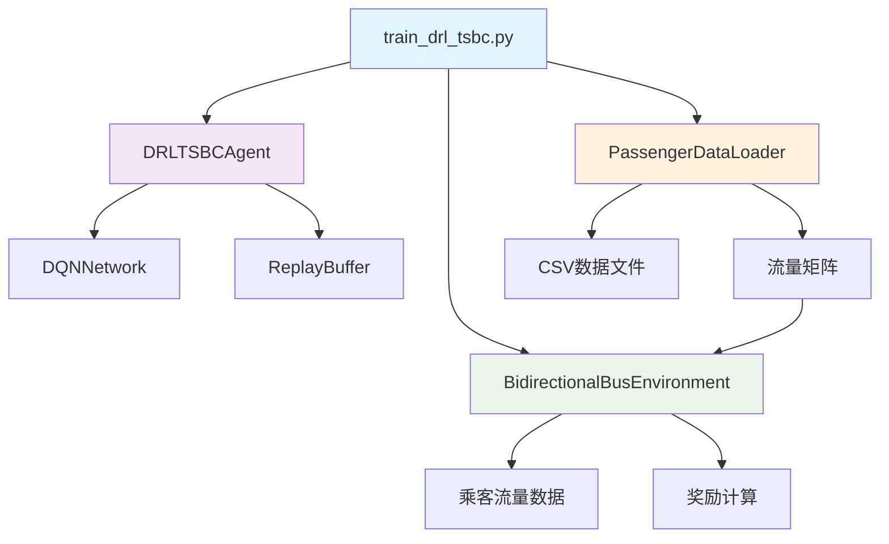

# DRL-TSBC项目完整说明文档

## 🎯 项目概述

本项目实现了**DRL-TSBC (Deep Reinforcement Learning-based dynamic bus Timetable Scheduling method with Bidirectional Constraints)** 算法，这是一个基于深度强化学习的双向动态公交时刻表排班算法。

### 核心特点
- **双向约束**: 确保上行和下行方向发车次数相等
- **动态决策**: 每分钟实时决策是否在两个方向发车
- **深度强化学习**: 使用DQN网络处理高维状态空间
- **实时适应**: 能够根据客流变化动态调整发车策略

## 📁 项目结构详解

```
DRL-TSBC/
├── src/                                    # 源代码目录
│   ├── algorithms/                         # 算法实现
│   │   ├── drl_tsbc.py                    # 核心DRL-TSBC算法
│   │   └── drl_bsa.py                     # DRL-BSA算法(对比用)
│   ├── environment/                        # 仿真环境
│   │   ├── bidirectional_bus_simulator.py # 双向公交仿真环境
│   │   └── bus_simulator.py               # 基础公交仿真环境
│   └── data_processing/                    # 数据处理
│       └── passenger_data_loader.py       # 乘客数据加载器
├── experiments/                            # 实验脚本
│   └── train_drl_tsbc.py                  # 训练脚本
├── data/                                   # 数据目录
│   ├── README.md                          # 数据说明
│   └── dataset_specification.md           # 数据集规格
├── requirements.txt                        # 依赖包
├── README.md                              # 项目说明
└── PROJECT_OVERVIEW.md                    # 本文档
```

## 🔧 各文件详细说明

### 1. 核心算法文件

#### `src/algorithms/drl_tsbc.py` - 主算法实现
**作用**: DRL-TSBC算法的核心实现
**包含组件**:
- `DQNNetwork`: DQN神经网络结构
- `ReplayBuffer`: 经验回放缓冲区
- `DRLTSBCAgent`: 主要的智能体类
- `BidirectionalTimetableOptimizer`: 双向时刻表优化器

**关键功能**:
```python
# 状态空间: 10维特征
# - 时间特征: 标准化小时、分钟
# - 双向特征: 上下行运力利用率、等待时间、滞留乘客
# - 约束特征: 发车次数差、总在途车辆数

# 动作空间: 4种组合
# - (0,0): 上下行都不发车
# - (0,1): 上行不发车，下行发车  
# - (1,0): 上行发车，下行不发车
# - (1,1): 上下行都发车
```

#### `src/algorithms/drl_bsa.py` - 对比算法
**作用**: DRL-BSA公交车辆调度算法，用于对比实验

### 2. 仿真环境文件

#### `src/environment/bidirectional_bus_simulator.py` - 双向仿真环境
**作用**: 专门为DRL-TSBC设计的双向公交线路仿真环境
**核心功能**:
- 模拟双向公交运营
- 处理乘客上下车
- 计算奖励函数
- 维护系统状态

**关键类**:
```python
class BidirectionalBusEnvironment:
    def __init__(self, service_start=360, service_end=1320, num_stations=37)
    def reset() -> np.ndarray  # 重置环境
    def step(action) -> Tuple[np.ndarray, float, bool, Dict]  # 执行动作
    def get_state() -> np.ndarray  # 获取当前状态
    def calculate_reward() -> float  # 计算奖励
```

#### `src/environment/bus_simulator.py` - 基础仿真环境
**作用**: 基础的公交系统仿真环境，为双向环境提供基础功能

### 3. 数据处理文件

#### `src/data_processing/passenger_data_loader.py` - 数据加载器
**作用**: 加载和处理真实的乘客数据
**核心功能**:
- 加载CSV格式的乘客刷卡数据
- 数据预处理和格式转换
- 生成乘客流量矩阵
- 时间格式转换

**数据格式支持**:
```python
# 输入数据格式
{
    "Label": "乘客唯一标志码",
    "Boarding time": "上车时间(分钟)",
    "Boarding station": "上车站点",
    "Alighting station": "下车站点", 
    "Arrival time": "到站时间(分钟)"
}
```

### 4. 实验脚本

#### `experiments/train_drl_tsbc.py` - 训练脚本
**作用**: 完整的训练和评估流程
**功能**:
- 训练DRL-TSBC智能体
- 绘制训练曲线
- 保存模型和结果
- 性能评估

## 🔄 文件间关系图



## 🚀 复现操作指南

### 步骤1: 环境配置
```bash
# 1. 克隆项目
git clone <your-repo>
cd DRL-TSBC

# 2. 安装依赖
pip install -r requirements.txt
```

### 步骤2: 数据准备
```bash
# 1. 将211、683线数据放入data/目录
data/
├── passenger_flow_211_683.csv  # 乘客刷卡数据
└── station_distances.csv       # 站点距离数据(可选)

# 2. 数据格式示例
# passenger_flow_211_683.csv:
# Label,Boarding time,Boarding station,Alighting station,Arrival time
# P001,391,1,5,385
# P002,392,2,8,390
```

### 步骤3: 运行训练
```bash
# 基础训练
python experiments/train_drl_tsbc.py

# 自定义参数训练
python experiments/train_drl_tsbc.py --episodes 2000 --learning_rate 0.001
```

### 步骤4: 查看结果
训练完成后会生成：
```
results/
├── drl_tsbc_model.pth          # 训练好的模型
├── training_history.json       # 训练历史
├── drl_tsbc_training_curves.png # 训练曲线图
└── performance_metrics.json    # 性能指标
```

## 📊 核心算法流程

### 训练流程
1. **初始化**: 创建DQN网络、经验池、仿真环境
2. **状态获取**: 从环境获取当前状态(10维特征)
3. **动作选择**: 使用ε-贪婪策略选择动作
4. **约束检查**: 应用Tmin/Tmax发车间隔约束
5. **环境交互**: 执行动作，获得奖励和下一状态
6. **经验存储**: 将经验存入回放缓冲区
7. **网络训练**: 从缓冲区采样训练DQN
8. **目标网络更新**: 定期更新目标网络

### 推理流程
1. **环境初始化**: 设置仿真环境
2. **实时决策**: 每分钟根据当前状态选择最优动作
3. **约束应用**: 确保满足发车间隔约束
4. **双向平衡**: 最终调整确保上下行发车次数相等

## 🎛️ 关键参数说明

### 算法参数
```python
# DQN参数
learning_rate = 0.001      # 学习率
gamma = 0.95              # 折扣因子
epsilon = 1.0             # 初始探索率
batch_size = 32           # 批次大小
buffer_size = 10000       # 经验池大小

# 约束参数
tmin = 3                  # 最小发车间隔(分钟)
tmax = 15                 # 最大发车间隔(分钟)

# 奖励函数权重
mu = 5000                 # 运营成本权重
delta = 200               # 服务质量权重
beta = 0.2                # 双向约束权重
zeta = 0.002              # 平衡因子
```

### 环境参数
```python
service_start = 360       # 服务开始时间(6:00)
service_end = 1320        # 服务结束时间(22:00)
num_stations = 37         # 站点数量
vehicle_capacity = 47     # 车辆容量
```

## 🔍 性能监控指标

训练过程中监控的关键指标：
- **总奖励**: 每轮训练的累积奖励
- **探索率**: ε值的衰减情况
- **上下行发车次数**: 双向发车平衡性
- **平均等待时间**: 乘客等车时间
- **运力利用率**: 车辆载客效率

## ⚠️ 注意事项

1. **数据格式**: 确保数据格式与`PassengerDataLoader`期望格式一致
2. **内存使用**: 大数据集可能需要调整`buffer_size`
3. **训练时间**: 完整训练可能需要几小时到几天
4. **GPU加速**: 建议使用GPU加速训练
5. **参数调优**: 根据具体线路特点调整超参数

## 📈 扩展建议

1. **多线路支持**: 扩展到多条公交线路
2. **实时数据**: 集成实时交通数据API
3. **可视化界面**: 添加Web界面展示结果
4. **性能优化**: 使用更高效的神经网络结构
5. **对比实验**: 与其他调度算法对比
